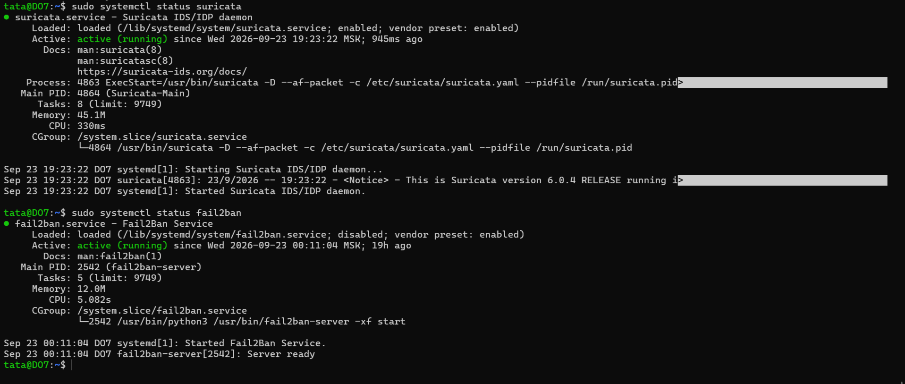
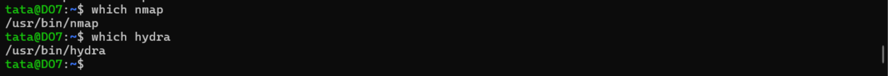
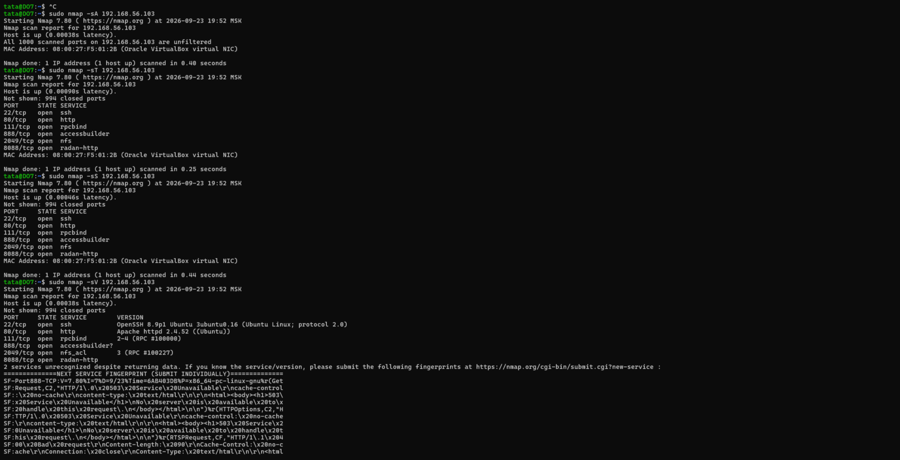
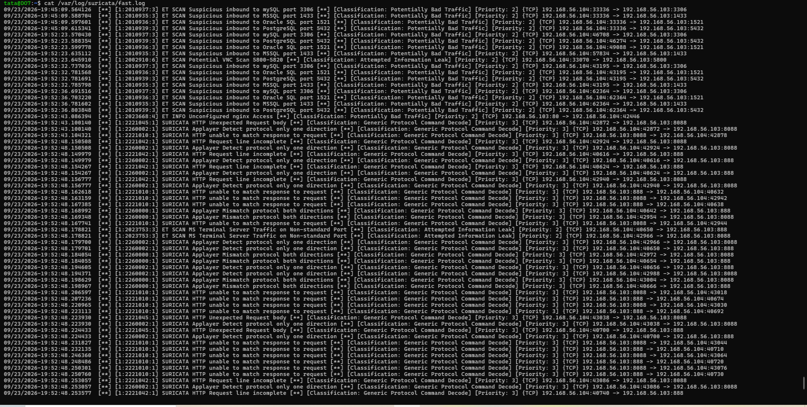
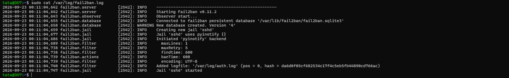
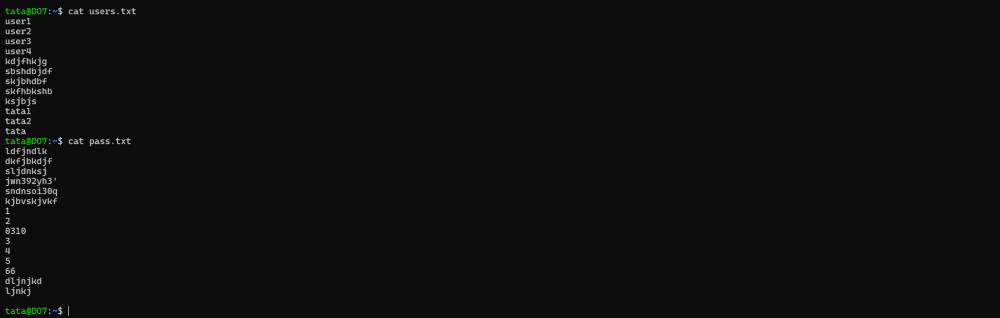
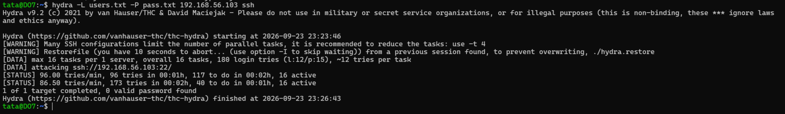
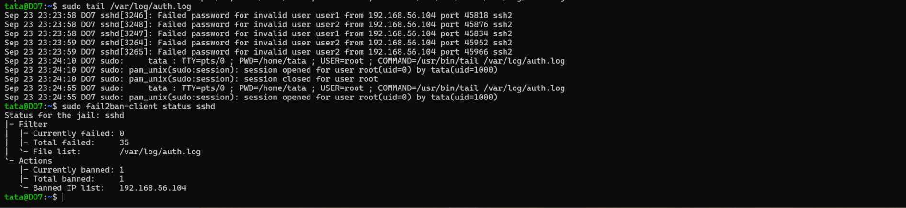

# Домашнее задание по занятию "Защита сети" -Фабричникова Татьяна Александровна

## Подготовка к выполнению заданий

>Подготовка атакуемой машины. Запущены службы suricata и fail2ban

>Подготовка атакующей машины. Установлены nmap и hydra

## Задание 1

Проведите разведку системы и определите, какие сетевые службы запущены в защищенной системе:

sudo nmap -sA <ip-адрес>

sudo nmap -sT <ip-адрес>

sudo nmap -sS <ip-адрес>

sudo nmap -sV <ip-адрес>

>Сканирование nmap-ом

>Логи Suricata. На фото видно , что с ip адреса  192.168.56.104 было зафиксировано множественное сканирование различных портов различных служб. Были отправлены "пустые" http-запросы,непонятные для сервера.
>
>SURICATA HTTP Request line incomplete — оборванные HTTP-запросы
>
>SURICATA HTTP unable to match response to request — ответы, не соответствующие запросам
>
>SURICATA HTTP Unexpected Request body — неожиданные тела запросов
>
>SURICATA Applayer Detect protocol only one direction — протокол виден только в одну сторону
>
>SURICATA Applayer Mismatch protocol both directions — разные протоколы в двух направлениях
>

>Логи Fail2Ban. Т.к. попыток подбора пароля не было, тут только старт сервиса и базовые настройки.

## Задание 2

 - На атакующей машине для гидры созданы файлы логинов и паролей

- Проводим атаку `hydra -L users.txt -P pass.txt 192.168.56.103 ssh`

- Проверяем файл с логами fail2ban /var/log/auth.log

В качестве ответа пришлите события, которые появились в логах Suricata и Fail2Ban, прокомментируйте результат.
